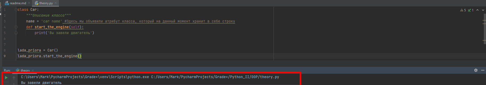

<h1>ООП - базовая теория и примеры</h1>

<h2>Создание класса, ега атрибуты и методы</h2>
____
Чтобы создать класс на языке python, вам необходимо воспользоваться ключевым словоом _class_
и написать седующую конструкцию:
```python
class Car:
    """Описание класса"""
```
Сейчас данный класс ни чего не делает, давайте расширим его функционал, добавив ему атрибуты и методы, но 
предварительно разберемся что они из себя представляют. 
>Атрибут класса-это по сути обычная переменная в языке python например как показано ниже:
```python
class Car:
    name = 'car name' #Здесь мы объявили атрибут класса, который на данный момент хранит в себе строку 
```
>Метод класса-это по сути та же функций на языке python, целью которой является расширение возможностей самого класса (в нашем примере мы добавим функцию завести машину), но она находится внутри класса и поэтому носит такое гордое название "Метод класса", ещё раз фактически это обычная функция на языке python
```python
class Car:
    name = 'car name' #Здесь мы объявили атрибут класса, который на данный момент хранит в себе строку 
    def start_the_engine():
        print('Вы завели двигатель')
```
В выше указанном примере мы с вами допустили ошибку, которая на самом деле не позволит нам завести машину. 
Важно понять одну из основных особенностей ООП. Существует **Класс** и **Его экземпляр(Экземпляр класа / Объект класса)**

Если простым языком, то мы попытались описать в общем понимание класс Car, тоесть не конкретно какую-то машину, а некую  абстракцию,
на базе которой мы в дальнейшем будем создавать сами автомобили (всякие жигули, мазды, камазы и т.д.)
Пока это сложно понять, но дальше станет проще (наверное).

Итак, чтобы завести двигатель нашей машины, мы должны создать эту самую машину, давайте это сделаем:
```python
lada_priora = Car()
```
>Примечание: указав скобки после Car мы говори python создать **Объект класса**, если их не указать, то вы
> вместо объекта получите ссылку!

И затем вызовем ранее написанный нами метод start_the_engine
```python
lada_priora.start_the_engine()
```
При попытки вывода получим следующие сообщение:
```
Traceback (most recent call last):
  File "C:\Users\Mark\PycharmProjects\Grade+\Python_II\OOP\theory.py", line 9, in <module>
    lada_priora.start_the_engine()
TypeError: Car.start_the_engine() takes 0 positional arguments but 1 was given

```
Основной посыл лежит в этой строчке:
>TypeError: Car.start_the_engine() takes 0 positional arguments but 1 was given

Где нам говорят, что у нас ошибка, в которой буквально сказано "Метод класса Car.start_the_engine()
принимает в себя 0 аргументов, но ожидает 1."

Если простыми словами, то наш метод start_the_engine() создан внутри класса Car и он не умеет работать
с его экземплярами, так как мы его этому не научили. 
Для того чтобы метод сумел взаимодействовать с **экземляром / объектом класса** на необходимо дополнить
код класса ключевым словом self. 

```python
class Car:
    name = 'car name' #Здесь мы объявили атрибут класса, который на данный момент хранит в себе строку
    def start_the_engine(self):
        print('Вы завели двигатель')
```
И теперь результат исполнения программы будет иным:

<h2>SELF Создание экземпляра класса</h2>
____
Расширим наш класс Car добавив в него новые атрибуты, сделаем это отталкиваясь от логики, как может быть 
описано большинстов автомобилей, какие у них могут быть характеристики:
- Объем двигателя
- Запас бака 
- Цвет кузова

```python
class Car:
    def __init__(self, name, engine, color):
        self.name = name            # Название авто
        self.engine = engine        # Объем двигателя
        self.color = color          # Цвет авто
```
Теперь создадим экземпляр класса, допустим это будет kia rio, 1.6 красного цвета, тогда нам стоит написать так:
```python
KiaRio = Car(name='Kia rio', engine=1.6, color='red')
```
И теперь благодаря слову self мы можем позволить **экземпляру класса** - KiaCar обратиться
к атрибутам описанным в классе Car
```python
print(KiaRio.name)
print(KiaRio.engine)
print(KiaRio.color)
```
То-есть еще раз что мы сделали. 
1. Создали класс Car который описывает АБСТРАКТНОЕ понятие автомобиля в нашей программе. Он дословно говорит
что машина обладает такими параметрами как: Название, объем двигателя, цвет кузова.
2. Создали экземпляр класса KiaRio и при его создании, благодаря ранее заложенному конструктору 
в класс Car, задали ему интересующие нас параметры. "name='Kia rio', engine=1.6, color='red'"
3. Вывели данные параметры в консоль.


Здесь я воспользовался так называемым **магическим методом** init
или его еще называют конструктор класса. Слово self позволит **экземпляру класса** обратиться к атрибутам и
методам **класса**
___
<h2>Инкапсуляция</h2>
_Инкапсуляция_ - Это свойство, которое объединяет данные и методы в классе, и скрывает их реализацию от пользователя.
Иными словами, это защищенность класса от его изменения пользователем. Так в python реализовано несколько уровней доступа
к внутреннему содержимому класса
___
<h2>Полиморфизм</h2>
Тут текст про полиморфизм
___
<h2>Наследование</h2>
Тут текст про наследование
___
