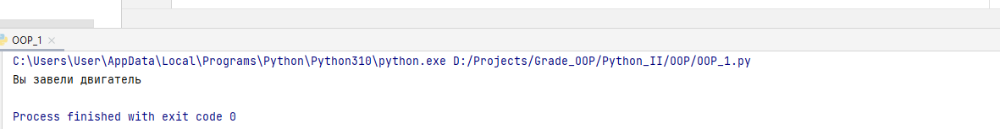
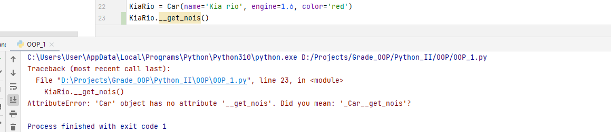
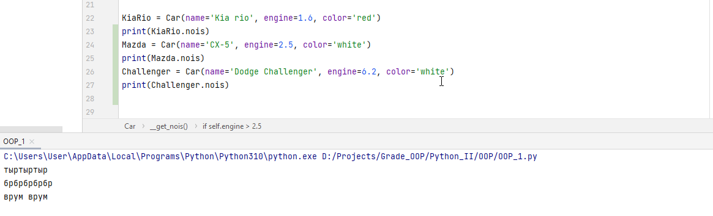
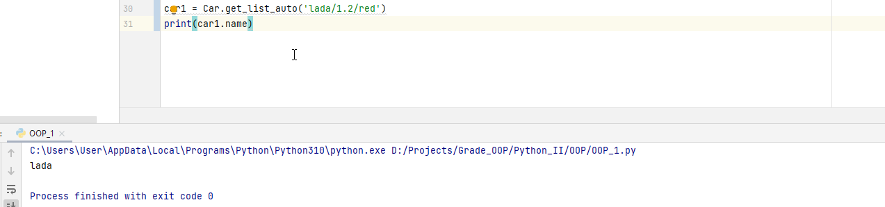
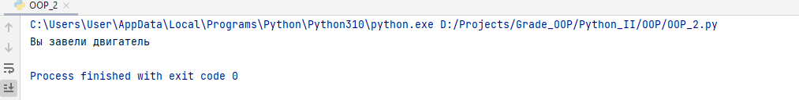

<h1>ООП - базовая теория и примеры</h1>

<h2>Создание класса, ега атрибуты и методы</h2>
____
Чтобы создать класс на языке python, вам необходимо воспользоваться ключевым словоом _class_
и написать седующую конструкцию:
```python
class Car:
    """Описание класса"""
```
Сейчас данный класс ни чего не делает, давайте расширим его функционал, добавив ему атрибуты и методы, но 
предварительно разберемся что они из себя представляют. 
>Атрибут класса-это по сути обычная переменная в языке python например как показано ниже:
```python
class Car:
    name = 'car name' #Здесь мы объявили атрибут класса, который на данный момент хранит в себе строку 
```
>Метод класса-это по сути та же функций на языке python, целью которой является расширение возможностей самого класса (в нашем примере мы добавим функцию завести машину), но она находится внутри класса и поэтому носит такое гордое название "Метод класса", ещё раз фактически это обычная функция на языке python
```python
class Car:
    name = 'car name' #Здесь мы объявили атрибут класса, который на данный момент хранит в себе строку 
    def start_the_engine():
        print('Вы завели двигатель')
```
В выше указанном примере мы с вами допустили ошибку, которая на самом деле не позволит нам завести машину. 
Важно понять одну из основных особенностей ООП. Существует **Класс** и **Его экземпляр(Экземпляр класа / Объект класса)**

Если простым языком, то мы попытались описать в общем понимание класс Car, тоесть не конкретно какую-то машину, а некую  абстракцию,
на базе которой мы в дальнейшем будем создавать сами автомобили (всякие жигули, мазды, камазы и т.д.)
Пока это сложно понять, но дальше станет проще (наверное).

Итак, чтобы завести двигатель нашей машины, мы должны создать эту самую машину, давайте это сделаем:
```python
lada_priora = Car()
```
>Примечание: указав скобки после Car мы говори python создать **Объект класса**, если их не указать, то вы
> вместо объекта получите ссылку!

И затем вызовем ранее написанный нами метод start_the_engine
```python
lada_priora.start_the_engine()
```
При попытки вывода получим следующие сообщение:
```
Traceback (most recent call last):
  File "C:\Users\Mark\PycharmProjects\Grade+\Python_II\OOP\theory.py", line 9, in <module>
    lada_priora.start_the_engine()
TypeError: Car.start_the_engine() takes 0 positional arguments but 1 was given

```
Основной посыл лежит в этой строчке:
>TypeError: Car.start_the_engine() takes 0 positional arguments but 1 was given

Где нам говорят, что у нас ошибка, в которой буквально сказано "Метод класса Car.start_the_engine()
принимает в себя 0 аргументов, но ожидает 1."

Если простыми словами, то наш метод start_the_engine() создан внутри класса Car и он не умеет работать
с его экземплярами, так как мы его этому не научили. 
Для того чтобы метод сумел взаимодействовать с **экземляром / объектом класса** на необходимо дополнить
код класса ключевым словом self. 

```python
class Car:
    name = 'car name' #Здесь мы объявили атрибут класса, который на данный момент хранит в себе строку
    def start_the_engine(self):
        print('Вы завели двигатель')
```
И теперь результат исполнения программы будет иным:

<h2>SELF Создание экземпляра класса</h2>
____
Расширим наш класс Car добавив в него новые атрибуты, сделаем это отталкиваясь от логики, как может быть 
описано большинстов автомобилей, какие у них могут быть характеристики:
- Объем двигателя
- Запас бака 
- Цвет кузова

```python
class Car:
    def __init__(self, name, engine, color):
        self.name = name            # Название авто
        self.engine = engine        # Объем двигателя
        self.color = color          # Цвет авто
```
Теперь создадим экземпляр класса, допустим это будет kia rio, 1.6 красного цвета, тогда нам стоит написать так:
```python
KiaRio = Car(name='Kia rio', engine=1.6, color='red')
```
И теперь благодаря слову self мы можем позволить **экземпляру класса** - KiaCar обратиться
к атрибутам описанным в классе Car
```python
print(KiaRio.name)
print(KiaRio.engine)
print(KiaRio.color)
```
То-есть еще раз что мы сделали. 
1. Создали класс Car который описывает АБСТРАКТНОЕ понятие автомобиля в нашей программе. Он дословно говорит
что машина обладает такими параметрами как: Название, объем двигателя, цвет кузова.
2. Создали экземпляр класса KiaRio и при его создании, благодаря ранее заложенному конструктору 
в класс Car, задали ему интересующие нас параметры. "name='Kia rio', engine=1.6, color='red'"
3. Вывели данные параметры в консоль.

Здесь я воспользовался так называемым **магическим методом** init
или его еще называют конструктор класса. Слово self позволит **экземпляру класса** обратиться к атрибутам и
методам **класса**
___
<h2>Инкапсуляция</h2>
_Инкапсуляция_ - Это свойство, которое объединяет данные и методы в классе, и скрывает их реализацию от пользователя.
Иными словами, это защищенность класса от его изменения пользователем. Так в python реализовано несколько уровней доступа
к внутреннему содержимому класса. 

Давайте расширим наш пример и добавим в него метод, который будет сообщать о работе автомобиля, но при этом, данный метод не даст себя модфицировать экземлярам класса:
```python
 def __get_nois(self):
        if self.engine < 1.6:
            return 'тыртыртыр'
        if 1.6 <= self.engine <= 2.5:
            return 'брбрбрбрбр'
        if self.engine > 2.5:
            return 'врум врум'
```
Здесь мы добавили двойное нижнее подчеркивание, которое говорит нам о том, что данный метод не доступен из вне класса.
Убедимся в этом:


И теперь добавим нвоый атрибу внутри класса, который позволит нам пользоваться приватным методом из экземпляров класса:
```python
def __init__(self, name, engine, color):
    self.nois = self.__get_nois() # Приватный метод, результат работы которого записывается в атрибут nois
```
Тоесть внутри класса, через его конструктор мы создаем атрибу, в который будет записываться результат работы приватной функции,
таким образом мы скрыли то, как работает данный метод, но при этом дали возможность его использования экземпляру класса.
и теперь если мы создадим несколько новых авто и посмотрим на результат вызова атрибута:
```python
KiaRio = Car(name='Kia rio', engine=1.6, color='red')
print(KiaRio.nois)

Mazda = Car(name='CX-5', engine=2.5, color='white')
print(Mazda.nois)

Challenger = Car(name='Dodge Challenger', engine=6.2, color='white')
print(Challenger.nois)
```


Тоесть для каждого авто, в зависимости от присвоенного ему атрибута engine приватный метод
get_nois() подобрал шум. И экземпляр класса, не может повлиять на этот выбор, изменив напрямую данный метод.
---
<h2>Методы класса</h2>
Мы рассмотрели с вами метод экземпляра класса, но по мимо него в python присутствует еще как минимум
2 часто используемых "типов" методов:

>_Методы класса_ - Это класс который не привязан к экземпляру класса, а является полноценнным методом класса и может быть вызван
без создания экземпляра (чего мы не могли сделать с методом экземпляра класса).
для использования данного метода используется декоратор @_classmethod_

Добавим такой метод в наш класс:
```python
@classmethod
def get_list_auto(cls, list_auto):
    name, engine, color = list_auto.split('/')
    car = cls(name, engine, color)
    return car
```
Мы создали метод, который может быть вызван без объявления экземпляра класса:
```python
car1 = Car.get_list_auto('lada/1.2/red')
```
и как резултат:


>_Статические методы_ - Это методы, которые могут вызываться через экземпляр класса, но при этом
> им нет необходимости принимать в себя объект класса как аругмент (self тут не нужен).
для использования данного метода используется декоратор @_staticmethod_

Помните в самом начале мы не могли завести двигатель, так как в метод не был передан self 
давайте исправим это досадное недарозумение: 
```python
@staticmethod
def start_the_engine():
print('Вы завели двигатель')
```


___
<h2>Наследование</h2>
Чтобы создать класс наследник надо воспользоваться следующим синтаксисом:
```python
class Cargo_car(Car): # Создали клас "Грузовой автомобиль" наследник класса "Авто"
    pass
```
Наследовнаие позволяет нам в какой-то степени систематизировать код, создавая новый класс
и добавляя в него уникальный функционал, который условно "не нужен" классу родителю.

Например наш класс Cargo_car унаследовал все методы класса Car в том числе и конструктор,
поэтмоу для созданя экземпляра класса Cargo_car мы все так же должны передать в него 
название, двигатель, цвет. Но давайте расширим наш клас и передадим в него максимальный вес груза.
```python
class Cargo_car(Car): # Создали клас "Грузовой автомобиль" наследник класса "Авто"
    def __init__(self, name, engine, color, weight, max_weight):
        super().__init__(name, engine, color)
        self.weight = float(weight)
        self.max_weight = float(max_weight)
```
Мы расширили конструктор дочернего класса, добавив по мимо уже существовавших атрибутов еще два новых
Максимальный вес и вес груза.
Так же в дочерний класс добавим новый метод, который является уникальным именно для Cargo_car
```python
def can_move(self):
    if self.weight > self.max_weight: #Проверка массы груза
        return 'Не могу тронуться'
    else:
        return 'поехали'
```
При этом наш новый класс все так же может пользоваться методами класса родителя:
```python
man_full_cargo = Cargo_car('MAN',8,'blue',11,10)
man_full_cargo.start_the_engine()
```
___
<h2>Полиморфизм</h2>
Полиморфизм в объектно-ориентированном программировании – это возможность обработки разных типов данных, т. е. принадлежащих к разным классам, с помощью "одной и той же" функции, или метода. На самом деле одинаковым является только имя метода, его исходный код зависит от класса. Кроме того, результаты работы одноименных методов могут существенно различаться. Поэтому в данном контексте под полиморфизмом понимается множество форм одного и того же слова – имени метода.
___